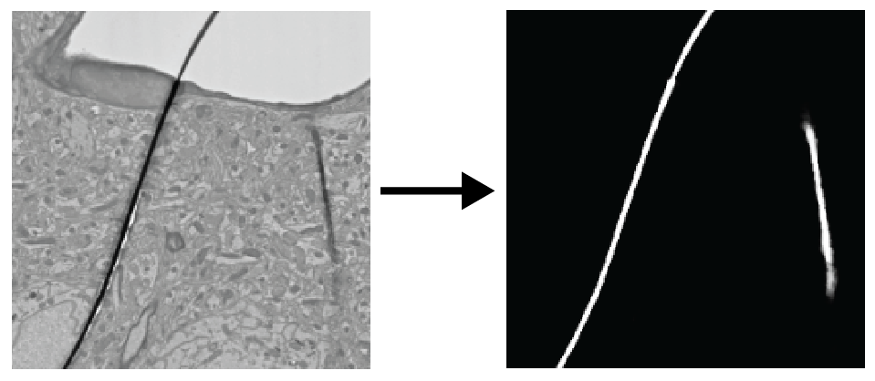
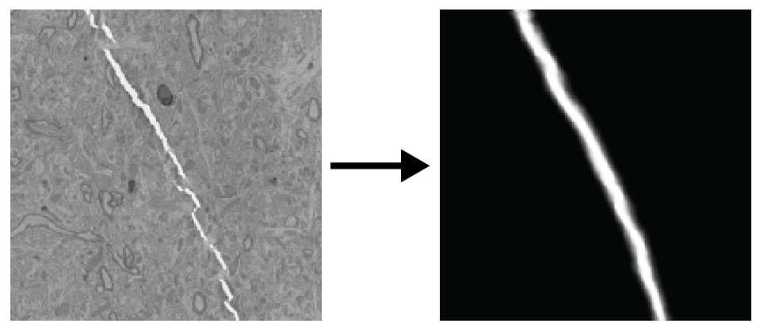

# detectEM (Gotta detect'em all)

Deep learning to detect particular features on EM images.  
1. Defect (fold/crack) detection 
- Fold  

- Crack  

2. Resin detection
3. Film detection


### Train
```
python train.py --exp_dir /experiment_directory/ 
--train_image /train_image.h5 --train_label /train_mask.h5
--val_image /val_image.h5 --val_label /val_mask.h5 --chkpt_num 0
```

### Inference
```
python inference.py --exp_dir /experiment_directory/ --chkpt_num 150000 
--input_file test_image.h5 --output_file pred_mask.h5
```

### Large-scale inference
Large-scale inference can be done using the [SEAMLeSS](https://github.com/seung-lab/SEAMLeSS) module. \
Use *alex-emdetector* branch.

- Single-label inference
```
python3 run_emdetector.py --model_path ../models/Zetta_RFNet0120/   
--src_path gs://zetta_aibs_human_unaligned/mip3_stack --dst_path gs://zetta_aibs_human_unaligned/masks/resin/resin_prelim 
--bbox_start 0 0 5100 --bbox_stop 1048576 1048576 5102 
--bbox_mip 0 --max_mip 8 --mip 6 --chunk_size 2048 2048 --overlap 32 32
```
- Multi-label inference
```
python3 run_multi_emdetector.py --model_path ../models/Zetta_RFNet0120/   
--src_path gs://zetta_aibs_human_unaligned/mip3_stack --dst1_path gs://zetta_aibs_human_unaligned/masks/resin/resin_prelim 
--dst2_path gs://zetta_aibs_human_unaligned/masks/film/film_prelim --bbox_start 0 0 5100 --bbox_stop 1048576 1048576 5102 
--bbox_mip 0 --max_mip 8 --mip 6 --chunk_size 2048 2048 --overlap 32 32
```
